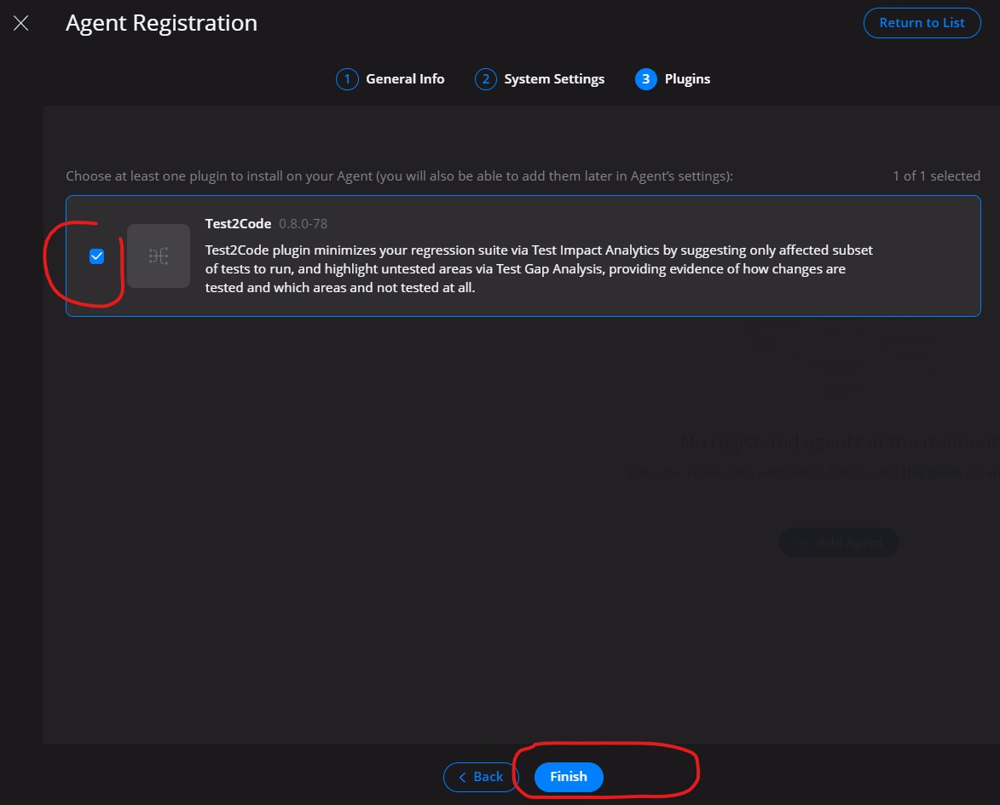
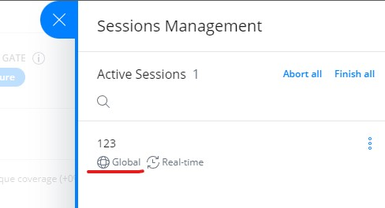

# Drill4J Java Agent 

 ## Terms
 _App Under Test_ - application that is being tested / subject of Drill4J metrics

## How to embed Drill4J Java Agent into docker image 
1. The following Dockerfile demonstrates how to embed drill4j java agent files into your docker image
```dockerfile
FROM ubuntu:latest

# Install OpenJRE 8 and utilities
RUN apt-get update && \
    apt-get install -y openjdk-8-jre wget unzip

# Download & unzip agent 
RUN wget -q -N https://github.com/Drill4J/java-agent/releases/download/v0.8.0-38/agent-linuxX64-0.8.0-38.zip && \
  mkdir -p /data/agent && \
  unzip -jo agent-linuxX64-0.8.0-38.zip 'linuxX64-0.8.0-38/*' -d /data/agent

COPY /build/my-app.jar /my-app.jar

# Set Drill4J params
# Admin Backend service address; without protocol; drill-admin is an example host, specify the actual host or IP
ARG DRILL_ADMIN_ADDRESS="drill-admin:8090"
ENV DRILL_ADMIN_ADDRESS=${DRILL_ADMIN_ADDRESS}

# specific service ID for drill4j; only latin, lowercase, digits, dashes
ARG MY_APP_ID="spring-backend"
ENV MY_APP_ID=${MY_APP_ID}

# app group ID for drill4j; only latin, lowercase, digits, dashes
ARG MY_APP_GROUP_ID="my-application"
ENV MY_APP_GROUP_ID=${MY_APP_GROUP_ID}

# pass version tag via env variable on each deployment; typically git tag or hash commit
ENV MY_APP_VERSION="unspecified"

# you can remove ",logLevel=TRACE" to suppress drill4j logs once you confirm Drill4J works "as-expected"
CMD java -agentpath:/data/agent/libdrill_agent.so=drillInstallationDir=/data/agent,adminAddress=${DRILL_ADMIN_ADDRESS},agentId=${MY_APP_ID},groupId=${MY_APP_GROUP_ID},buildVersion=${MY_APP_VERSION},logLevel=TRACE -jar my-app.jar
```

2. Make sure to pass MY_APP_ID env variable when launching application
```yml
version: '3'

services:
  my-app-spring-backend:
    image: my-app
    environment:
      - "MY_APP_VERSION=1.2.3" // pass actual app under test version (either semver version tag or commit hash)
```

## App registration

You _must_ register application in Drill4J Admin UI. This is _one-time_ procedure, required only on first App Under Test deployment.

1. Configure and deploy your _Application Under Test_ according to previous section
2. Open Drill4J Admin Panel UI

    - _If there are other agents_ already registered on this Drill4J instance:
        - you will see "Select Agent" button on the main screen
        - press it
        - modal window will appear
        - in the top-right corner press "Add agent" button
            
        - proceed to next step

    - _If its the first agent_ being registered on this Drill4J instance:
        - you will see "Add Agent" button on the main screen
        - press it
        - proceed to next step

3. Expand group entry, click on `Register` button _for a specific app_ (this step is _crucial_):
    

4. Registration is a 3-step process:

    1. Step 1 - leave everything "as-is" and press `Next` button
    2. Step 2 - enter package filter in the `Application Packages` field (use the most common top-level package specific to your application); Press `Next` button
        
    3. Step 3 - make sure there is a checkmark next to `Test2Code Plugin` entry and press "finish"
        
    4. Wait for the registration process to complete.
        - Depending on application size it may from 5 to 20 minutes
        - In case error appears on web UI - you can safely ignore it. Its a known UI bug
    5. Once registration process is completed you should be able to click on agent entry in agents list to navigate to the following page. Press `Go to plugin` button
        

5. Confirm everything works as expected
    - You must see element called `Active scope` on the right side of the page.
    - You must see list of application's packages in the table at the bottom of the page
        

## CI/CD and test launch changes

Current version of Drill4J requires following API calls to be made from CI/CD pipeline in order to save collected metrics.

In CI/CD pipeline responsible for test environment update:

- __Before__ _"previous"_ application under test version is disabled, execute [./finish-scope.sh](./finish-scope.sh) (Set your variables accordingly)
- __After__ _"new" application under test version is deployed, execute [./start-global-session.sh](./start-global-session.sh)

If everything is setup correctly:

1. You should see active session indicator (red dot inside green circle):

    

2. Click on "Session management" link in `Active Scope` section. You should see session with type "global":

    
